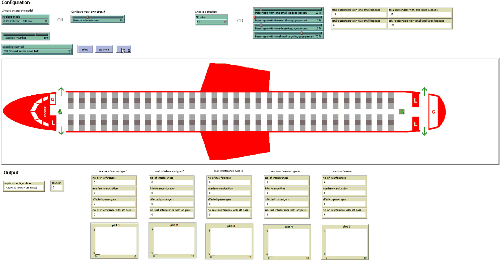
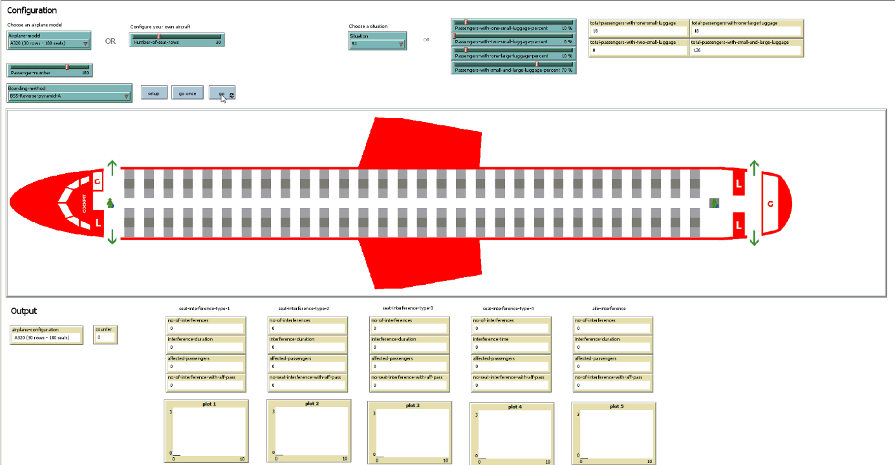

Please feel free to contact us at liviu.cotfas at ase .ro for the `NetLogo` source code.

# Boarding Methods

> All the simulations below have been performed using the luggage situation S1, described in our paper.

## BS2-Back-to-front

## BS3-Spread-across-rows

## BS4-Spread-across-rows-half

## BS5-Reverse-pyramid-A

## BS6-Reverse-pyramid-B

## BS7-Reverse-pyramid-C

## BS8-Reverse-pyramid-D

## BS9-Reverse-pyramid-E

## BS10-Reverse-pyramid-F

## BS11-Hybrid-A

## BS12-Hybrid-B

## BS13-Hybrid-C

## BS14-Hybrid-D

## BS15-Hybrid-E
